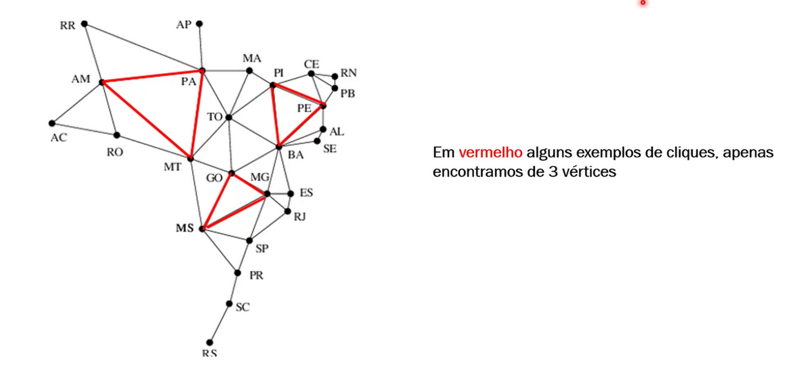
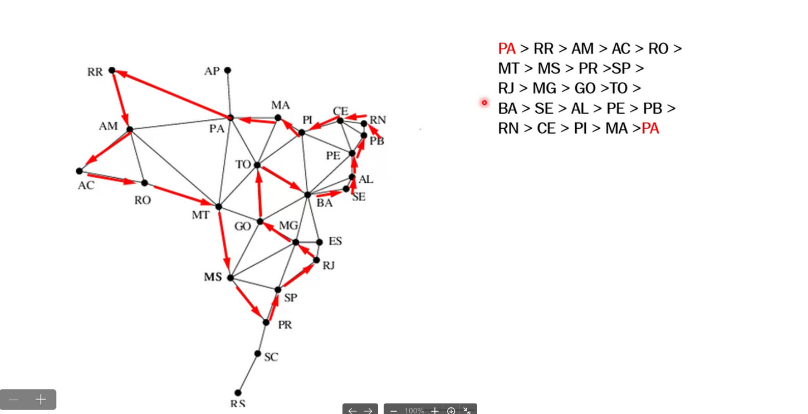
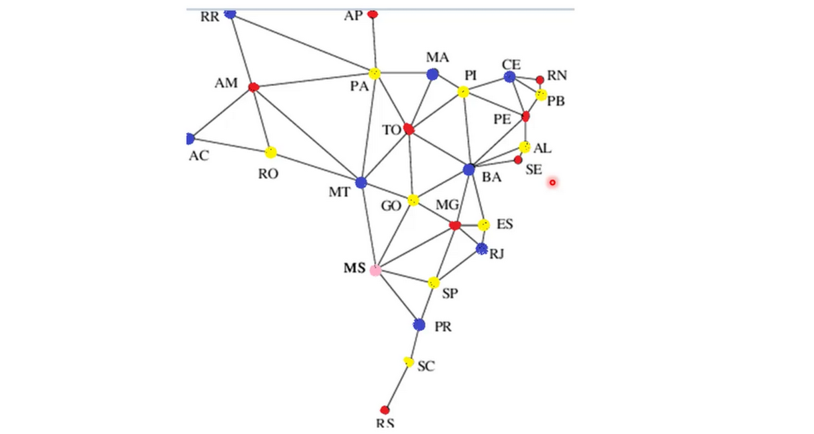
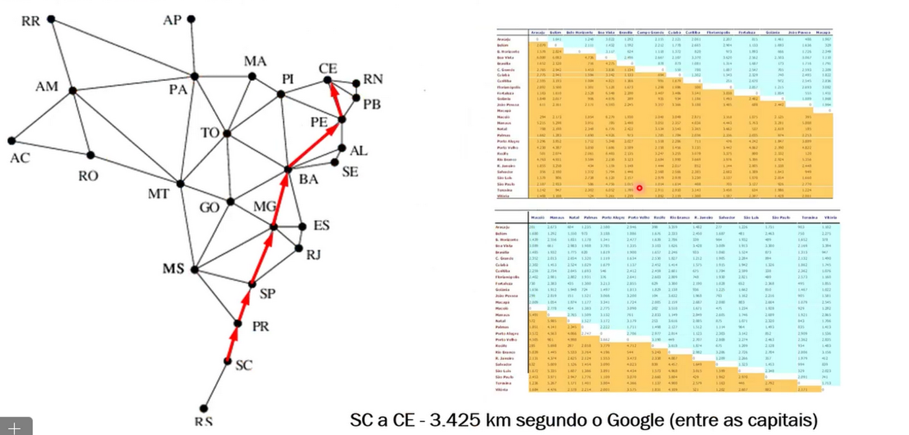

# graph-exercises
🪶 Exercises about graphs for IA class.

# [#1](src/_1.py)

```
20

Process finished with exit code 0
```


# [#2](src/_2.py)

```
{'Acre': ['Amazonas', 'Rondônia'], 'Amapá': ['Pará'], 'Amazonas': ['Acre', 'Roraima', 'Rondônia', 'Pará', 'Mato Grosso'], 'Pará': ['Amapá', 'Maranhão', 'Tocantins', 'Mato Grosso', 'Amazonas', 'Roraima'], 'Rondônia': ['Amazonas', 'Mato Grosso', 'Acre'], 'Roraima': ['Amazonas', 'Pará'], 'Tocantins': ['Maranhão', 'Pará', 'Piauí', 'Goiás', 'Mato Grosso', 'Bahia'], 'Alagoas': ['Pernambuco', 'Sergipe', 'Bahia'], 'Bahia': ['Alagoas', 'Sergipe', 'Pernambuco', 'Piauí', 'Tocantins', 'Goiás', 'Minas Gerais', 'Espírito Santo'], 'Ceará': ['Rio Grande do Norte', 'Paraíba', 'Pernambuco', 'Piauí'], 'Maranhão': ['Pará', 'Tocantins', 'Piauí'], 'Paraíba': ['Rio Grande do Norte', 'Ceará', 'Pernambuco'], 'Pernambuco': ['Paraíba', 'Ceará', 'Piauí', 'Bahia', 'Alagoas'], 'Piauí': ['Maranhão', 'Ceará', 'Pernambuco', 'Bahia', 'Tocantins'], 'Rio Grande do Norte': ['Ceará', 'Paraíba'], 'Sergipe': ['Alagoas', 'Bahia'], 'Distrito Federal': ['Goiás'], 'Goiás': ['Mato Grosso', 'Mato Grosso do Sul', 'Tocantins', 'Minas Gerais', 'Bahia', 'Distrito Federal'], 'Mato Grosso': ['Rondônia', 'Amazonas', 'Pará', 'Tocantins', 'Goiás', 'Mato Grosso do Sul'], 'Mato Grosso do Sul': ['Goiás', 'Mato Grosso', 'Minas Gerais', 'São Paulo', 'Paraná'], 'Espírito Santo': ['Bahia', 'Minas Gerais', 'Rio de Janeiro'], 'Minas Gerais': ['Espírito Santo', 'Rio de Janeiro', 'São Paulo', 'Goiás', 'Bahia'], 'Rio de Janeiro': ['Espírito Santo', 'Minas Gerais', 'São Paulo'], 'São Paulo': ['Rio de Janeiro', 'Minas Gerais', 'Paraná', 'Mato Grosso do Sul'], 'Paraná': ['São Paulo', 'Mato Grosso do Sul', 'Santa Catarina'], 'Rio Grande do Sul': ['Santa Catarina'], 'Santa Catarina': ['Paraná', 'Rio Grande do Sul']}
O estado Amapá é o estado com menos fronteiras, tendo apenas 1
O estado Bahia é o estado com mais fronteiras, tendo 8

Process finished with exit code 0
```

# #3

Segundo o professor:




# #4

Segundo o professor:



# #5

Segundo o professor:


